# Muthukrishnan Bommiah – Personal Portfolio 🚀

---

[](https://nextjs.org/)
[](https://www.typescriptlang.org/)
[](https://tailwindcss.com/)

---

## 🚦 Table of Contents

- [Prompts](./prompts.md)
- [Wiki](https://deepwiki.com/muthub-ai/muthu-v0-portfolio-website/1-overview)
- [Live Site](#live-site)
- [Features](#features)
- [Architecture Overview](#architecture-overview)
- [Content Management](#content-management)
- [Images & Assets](#images--assets)
- [Getting Started](#getting-started)
- [Contributing](#contributing)
- [Reference](#reference)
- [License](./LICENSE)

---

## 🌐 Live Site

Visit the portfolio at: **[https://muthu-m9.vercel.app/](https://muthu-m9.vercel.app/)**

---


## ✨ Features

- 📂 **Projects**: Showcases recent and featured work with images, descriptions, and tech stack.
- 🧑‍💼 **Experience**: Timeline of professional roles, achievements, and technologies used.
- 🏅 **Credentials**: Certifications, education, and key skills.
- 🛠️ **Technical Skills**: Categorized skills grid for quick overview.
- 🌍 **Languages & Interests**: Multilingual and diverse interests.
- 🖼️ **Customizable Content**: All data managed via a single JSON file.
- 🏗️ **Modern Stack**: Built with Next.js, TypeScript, Tailwind CSS, and more.
- 📈 **Analytics**: Integrated with Vercel Analytics for traffic insights.

## Key Initiatives

- [Generative AI SDLC Accelerator](https://muthu-m9.vercel.app/projects/generative-ai-sdlc)
- [Customer Analytics Platform](https://muthu-m9.vercel.app/projects/customer-analytics)
- [Cloud Data Migration Suite](https://muthu-m9.vercel.app/projects/cloud-data-migration)

<!-- Add or update project names/links as needed -->

---


## Architecture Overview

```mermaid
flowchart TD
	%% Developer Workflow
	subgraph "Developer Workflow"
		DEV["Developer"]:::developer
		CICD["CI/CD Pipeline"]:::developer
		DEV -->|"push code"| CICD
	end

	%% Build System
	subgraph "Next.js Build Server" 
		BUILD["Next.js Build Server"]:::build
		DATA_JSON[("portfolio-data.json")]:::data
		UTIL_DATA["lib/data.ts"]:::build
		UTIL_PROJECTS["lib/projects.ts"]:::build
		UTIL_UTILS["lib/utils.ts"]:::build
		APP_FOLDER["app/ (App Router)"]:::build
		LAYOUT["layout.tsx"]:::build
		HOME_PAGE["page.tsx"]:::build
		ROUTES["projects/[slug]"]:::build
		NOTFOUND["not-found.tsx"]:::build
		PROJECT_PAGE["page.tsx"]:::build
		BUILD -->|"reads JSON"| DATA_JSON
		DATA_JSON -->|"data-fetch"| UTIL_DATA
		UTIL_DATA --> BUILD
		UTIL_PROJECTS --> BUILD
		UTIL_UTILS --> BUILD
		CICD -->|"triggers build"| BUILD
		BUILD -->|"process routes"| APP_FOLDER
		APP_FOLDER --> LAYOUT
		APP_FOLDER --> HOME_PAGE
		APP_FOLDER --> ROUTES
		ROUTES --> NOTFOUND
		ROUTES --> PROJECT_PAGE
	end

	%% Static Assets & Styles
	subgraph "Static Assets & Styles"
		PUBLIC["public/"]:::asset
		RESUME["Muthu_resume.pdf"]:::asset
		GLOBALS_APP["app/globals.css"]:::asset
		GLOBALS_STYLE["styles/globals.css"]:::asset
		TAILWIND["tailwind.config.ts"]:::asset
		POSTCSS["postcss.config.mjs"]:::asset
		NEXTCFG["next.config.mjs"]:::asset
		TSCFG["tsconfig.json"]:::asset
		BUILD -->|"outputs assets"| PUBLIC
		PUBLIC --> RESUME
		BUILD --> GLOBALS_APP
		BUILD --> GLOBALS_STYLE
		BUILD --> TAILWIND
		BUILD --> POSTCSS
		BUILD --> NEXTCFG
		BUILD --> TSCFG
	end

	%% CDN & Hosting
	subgraph "CDN / Cloud Hosting"
		CDN["CDN / Cloud Provider"]:::cloud
		PUBLIC -->|"deploy assets"| CDN
		BUILD -->|"deploy static HTML"| CDN
	end

	%% Client Side
	subgraph "Client (Browser)"
		BROWSER["Browser"]:::client
		BROWSER -->|"request page"| CDN
		CDN -->|"serve HTML/JS/CSS"| BROWSER
		subgraph "Hydration & UI"
			CONTEXT["Animation Context"]:::client
			HOOK["use-intersection-observer"]:::client
			UI_DIR["components/"]:::client
			UI_ATOM["components/ui/"]:::client
			BROWSER --> CONTEXT
			BROWSER --> HOOK
			BROWSER --> UI_DIR
			BROWSER --> UI_ATOM
		end
	end

	%% Styles
	classDef developer fill:#f0f8ff,stroke:#000
	classDef build fill:#e6f7ff,stroke:#000
	classDef data fill:#dfffe0,stroke:#000
	classDef asset fill:#fff7e6,stroke:#000
	classDef cloud fill:#f0e6ff,stroke:#000
	classDef client fill:#ffe6e6,stroke:#000

	%% Click Events
	click APP_FOLDER "https://github.com/muthub-ai/muthu-v0-portfolio-website/tree/main/app/"
	click LAYOUT "https://github.com/muthub-ai/muthu-v0-portfolio-website/blob/main/app/layout.tsx"
	click HOME_PAGE "https://github.com/muthub-ai/muthu-v0-portfolio-website/blob/main/app/page.tsx"
	click NOTFOUND "https://github.com/muthub-ai/muthu-v0-portfolio-website/blob/main/app/projects/[slug]/not-found.tsx"
	click PROJECT_PAGE "https://github.com/muthub-ai/muthu-v0-portfolio-website/blob/main/app/projects/[slug]/page.tsx"
	click UI_DIR "https://github.com/muthub-ai/muthu-v0-portfolio-website/tree/main/components/"
	click UI_ATOM "https://github.com/muthub-ai/muthu-v0-portfolio-website/tree/main/components/ui/"
	click CONTEXT "https://github.com/muthub-ai/muthu-v0-portfolio-website/blob/main/contexts/animation-context.tsx"
	click HOOK "https://github.com/muthub-ai/muthu-v0-portfolio-website/blob/main/hooks/use-intersection-observer.ts"
	click DATA_JSON "https://github.com/muthub-ai/muthu-v0-portfolio-website/blob/main/data/portfolio-data.json"
	click UTIL_DATA "https://github.com/muthub-ai/muthu-v0-portfolio-website/blob/main/lib/data.ts"
	click UTIL_PROJECTS "https://github.com/muthub-ai/muthu-v0-portfolio-website/blob/main/lib/projects.ts"
	click UTIL_UTILS "https://github.com/muthub-ai/muthu-v0-portfolio-website/blob/main/lib/utils.ts"
	click GLOBALS_APP "https://github.com/muthub-ai/muthu-v0-portfolio-website/blob/main/app/globals.css"
	click GLOBALS_STYLE "https://github.com/muthub-ai/muthu-v0-portfolio-website/blob/main/styles/globals.css"
	click TAILWIND "https://github.com/muthub-ai/muthu-v0-portfolio-website/blob/main/tailwind.config.ts"
	click POSTCSS "https://github.com/muthub-ai/muthu-v0-portfolio-website/blob/main/postcss.config.mjs"
	click NEXTCFG "https://github.com/muthub-ai/muthu-v0-portfolio-website/blob/main/next.config.mjs"
	click TSCFG "https://github.com/muthub-ai/muthu-v0-portfolio-website/blob/main/tsconfig.json"
```


---
## 📁 Content Management

All content is managed in [`data/portfolio-data.json`](./data/portfolio-data.json). Update your:
- Personal info, social links, and avatar
- About, languages, and interests
- Experience, credentials, and skills
- Technical skills and project highlights

---

## 🖼️ Images & Assets
Place your images (profile, logos, project screenshots) in the `public/` directory and reference them in the JSON file.

---

## 🏃‍♂️ Getting Started

```bash
npm install
npm run dev
```

Open [http://localhost:3000](http://localhost:3000) to view your portfolio.

---

## 🤝 Contributing
This is a personal project, but feel free to fork and adapt for your own portfolio!


## 📄 Reference

- [Project Prompts](./prompts.md)

This project is licensed under the [MIT License](./LICENSE).

---


---

## 🛠️ Credits & Stack

Loosely designed in Figma (design tool) and fully built and maintained in Visual Studio Code (code editor) by yours truly. Built with Next.js and Tailwind CSS, deployed with Vercel. All text is set in the Inter typeface.

---

> Built and maintained by Muthukrishnan Bommiah. Thank you for visiting my portfolio! ✨
